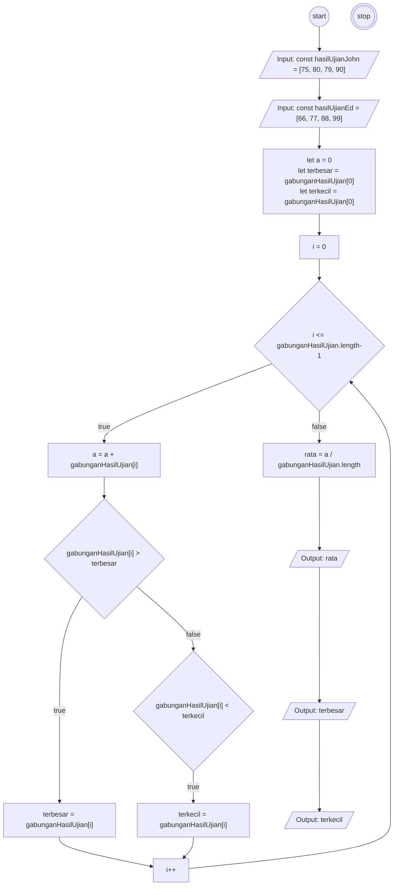

```mermaid
flowchart TD
    start@{shape: circle}
    inputArray1@{ shape: lean-r, label: "Input: const hasilUjianJohn = [75, 80, 79, 90]"}
    inputArray2@{ shape: lean-r, label: "Input: const hasilUjianEd = [66, 77, 88, 99]"}
    proses@{ label: "let a = 0
    let terbesar = gabunganHasilUjian[0]
    let terkecil = gabunganHasilUjian[0]
    "}
    for1@{ label: "i = 0"}
    for2@{ shape: diamond, label: "i <= gabunganHasilUjian.length-1"}
    a@{ label: "a = a + gabunganHasilUjian[i]"}
    if1@{ shape: diamond, label: "gabunganHasilUjian[i] > terbesar"}
    if1true@{ label: "terbesar = gabunganHasilUjian[i]"}
    if2@{ shape: diamond, label: "gabunganHasilUjian[i] < terkecil"}
    if2true@{ label: "terkecil = gabunganHasilUjian[i]"}
    iterasi@{ label: "i++"}
    rata@{ label: "rata = a / gabunganHasilUjian.length"}
    output1@{ shape: lean-r, label: "Output: rata"}
    output2@{ shape: lean-r, label: "Output: terbesar"}
    output3@{ shape: lean-r, label: "Output: terkecil"}
    stop@{ shape: dbl-circ}

start-->inputArray1-->inputArray2-->proses
proses-->for1-->for2--true-->a
a-->if1--true-->if1true-->iterasi
if1--false-->if2--true-->if2true-->iterasi
iterasi--->for2--false-->rata
rata-->output1-->output2-->output3
```